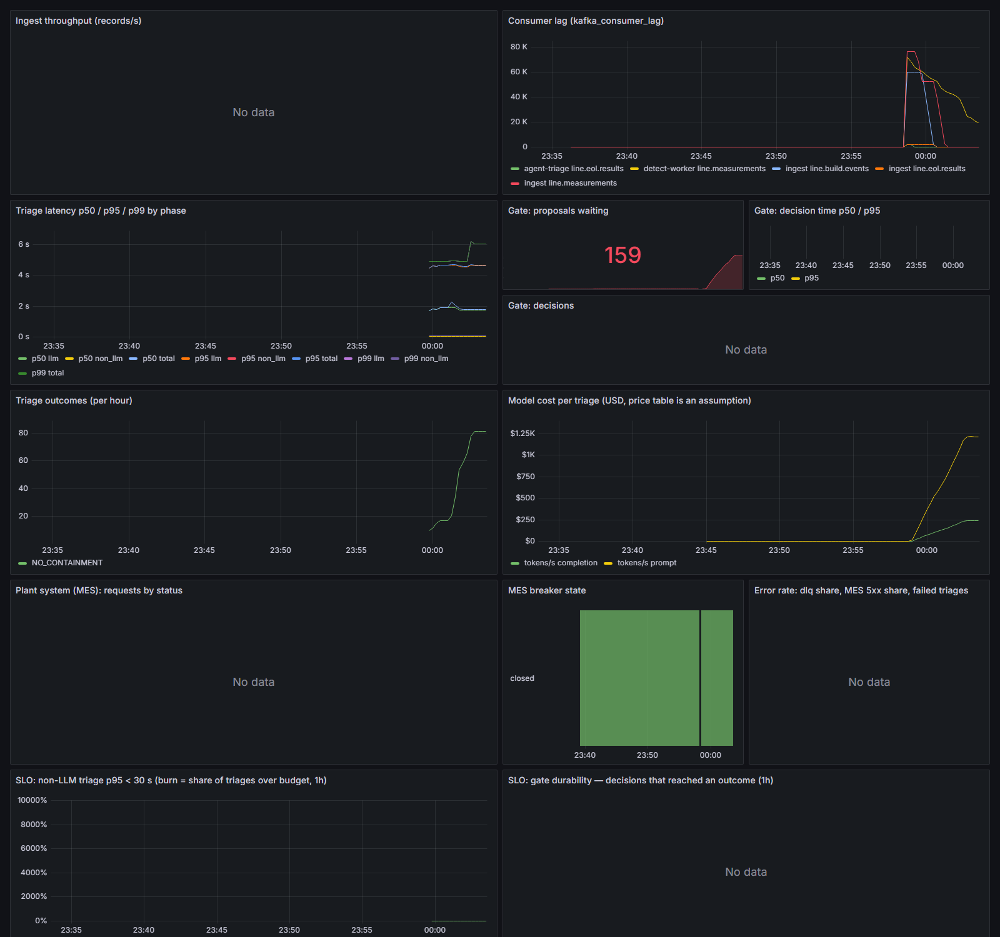

# qgate-agent

> **Status: phases 0–5 complete** — data spine, deterministic detection, the gated agent, console, C++ line replay, reliability, observability and pipelines. Phase 6 (ship) is next. Design: [`docs/design/2026-09-21-architecture.md`](docs/design/2026-09-21-architecture.md); decisions: [`docs/adr`](docs/adr).

When a vehicle fails end-of-line test, someone has to decide within minutes how many vehicles to quarantine — too narrow and a defect escapes to a customer, too wide and hundreds of good cars are held. `qgate-agent` correlates the failure against build genealogy and station drift, proposes a containment window, and **requires a human to approve it before anything is written**. It runs on a simulated line and is measured on fifty golden scenarios — including the ones where the right answer is to propose nothing.

## Metrics

Fifty golden cases, replayed in CI on every push against a committed baseline (`make eval-replay`);
the live-model run is published on demand to
[the evaluation page](https://zakaria17amir.github.io/Qgate-Agent/). Latest committed baseline
(replay of recorded `claude-haiku-4-5` answers, 2026-09-22, n = 50):

| Metric | Value | Notes |
|---|---|---|
| Escapes | **260** | all in the `overlap` family: two containments needed, one proposed — the known limitation |
| Containment precision / recall | 0.59 / 0.96 | |
| Decision match | 0.96 | 48/50 chose the golden's kind of answer |
| Agreement rate (approved unamended) | 0.66 | |
| Abstention correct rate | 1.00 | bench faults and contradictory evidence hold nothing |
| Deterministic path p50 / p95 | 106 / 128 ms | no model; the CI gate |
| Live model share p50 / p95 / p99 | 3.9 / 5.7 / 8.7 s | n = 264 real triages; two calls each |
| Under load: trigger → proposal p50 / p95 / p99 | 518 ms / 3.6 s / 4.3 s | n = 1 090, 5 VUs + a 50-VU burst, replay mode |
| Cost per triage | $0.0031 | price table is an assumption |

Method and boundaries: [`docs/latency.md`](docs/latency.md) · scoring: [`docs/eval.md`](docs/eval.md).



## Run it

```bash
cp .env.example .env
make up                                   # core stack
make demo SCENARIO=tool_wear SPEED=10     # C++ line-sim replays the scenario at 10x takt
make token ROLE=approver SUB=alice        # paste it into the console's Token drawer
```

Open `http://localhost:8080`: failures appear in the queue as the line runs; open one, read the
evidence, approve / amend / reject; the hold reaches the (mock) plant system only after that.
`RUNBOOK.md` §0 walks a shift leader through it. `make help` lists every target; each maps to one
CI job. `make chaos && make chaos-test` cuts the plant system mid-commit and kills the agent
mid-gate, and checks that exactly one hold results either way. `make up-all` adds Prometheus,
Grafana (`:3000`, the dashboard above), Langfuse traces (`:3001`) and Prefect (`:4200`);
`make load` runs the k6 test; `make flows` runs the three Prefect flows.

Deployment targets: laptop / on-prem compose (this, CI-verified); air-gapped with a native Ollama
(`make up-airgap`, `qwen2.5:7b` — wired, **not yet exercised**); k3s (documented in Phase 6).

## How it works

```
line-sim (C++) ──Kafka──▶ ingest ──▶ Postgres ◀── agent tools (read-only)
                  │                                   │
                  ├──────▶ detect ◀── HTTP ───────────┤  LangGraph triage graph
                  │                                   │  … → compose → GATE → commit
                  └──────▶ agent ◀── eol failures     │
                                                      ▼
                        console ──▶ api ◀── approve / amend / reject ──▶ mock-mes
```

The agent's blast radius is one pending record awaiting a human. Every tool is read-only except `submit_for_approval`, and the database role it uses cannot write.

## Repository map

| Path | What |
|---|---|
| `packages/qgate-core` | Shared domain models, Avro, Kafka, OTel, auth |
| `packages/qgate-generator` | Synthetic line, seven defect scenarios with ground truth, Python replay producer |
| `services/line-sim` | C++ event producer at takt |
| `services/ingest` `detect` `agent` `api` `mock-mes` | See architecture doc §4–§6 |
| `console` | React approval console |
| `pipelines` | Prefect flows: replay, nightly eval, publish |
| `schemas` | Avro contracts for the five topics |
| `knowledge/fault_map.yaml` | Hand-authored fault code → candidate stations |
| `eval/goldens` | Fifty golden cases, frozen before the agent existed |
| `docs/adr` | Architecture decision records |

## Data and licence

All committed data is synthetic. Competition datasets (e.g. Bosch Production Line Performance) are never committed; an optional adapter reads them from a local path you supply. Code is MIT.
