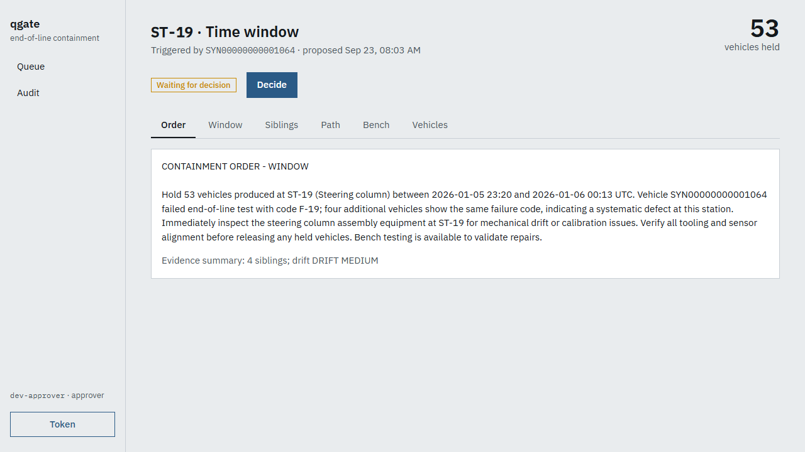
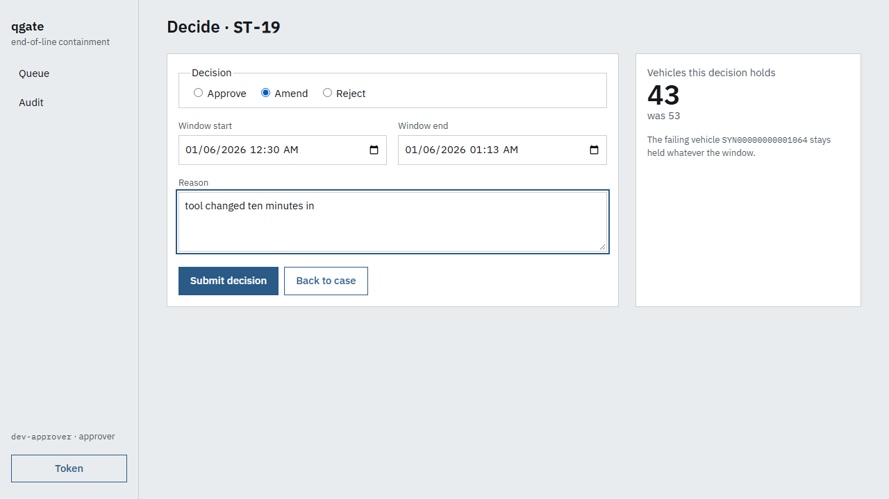

# qgate-agent

When a vehicle fails end-of-line test, someone has to decide within minutes how many vehicles to
quarantine — too narrow and a defect escapes to a customer, too wide and hundreds of good cars are
held. `qgate-agent` correlates the failure against build genealogy and station drift, proposes a
containment window, and **requires a human to approve it before anything is written**. It runs on
a simulated line and is measured on fifty golden scenarios — including the ones where the right
answer is to propose nothing.

All data is synthetic. No number below is a plant figure.

## Numbers

Fifty golden cases (`goldens-v1.1`), live model `claude-haiku-4-5`, **2026-09-23**, n = 50 —
[the evaluation page](https://zakaria17amir.github.io/Qgate-Agent/) (`metrics.json` there). The
same fifty replay from recorded answers on every push as the CI gate (`make eval-replay`).

| Metric | Value | Notes |
|---|---|---|
| Escapes | **260** | all in the `overlap` family (4 cases): two containments needed, one proposed — the known limitation |
| Containment precision / recall | 0.59 / 0.96 | recall is 1.00 on every family but `overlap` |
| Decision match | 0.96 | 48/50 chose the golden's kind of answer |
| Agreement rate (approved unamended) | 0.66 | |
| Abstention correct rate | 1.00 | bench faults and contradictory evidence hold nothing |
| Triage p50 / p95 | 3.7 / 4.6 s | model ≈ 99 % of it; non-model p95 58 ms |
| Cost per triage | $0.0033 | price table is an assumption |

| SLO (design §12) | Target | Measured | How |
|---|---|---|---|
| Proposal ready | p95 ≤ 30 s from the failure | 3.6 s under load (n = 1 090, replay); 5.8 s with the live model (n = 264) | k6 + `triage_duration_seconds` — [`docs/latency.md`](docs/latency.md) |
| Event loss | 0 lost; DLQ explains every rejection | 138 624 produced = delivered = rows in Postgres; DLQ empty | line-sim counters vs manifest |
| Gate durability | 100 % of pending gates survive an agent restart | 2/2, twice, on real containers | `make chaos-test` |
| Commit correctness | exactly one plant hold per approval | one hold after a 20 s MES outage mid-commit | `make chaos-test` + mock-MES duplicate counter |

Scoring: [`docs/eval.md`](docs/eval.md) · latency boundaries and method: [`docs/latency.md`](docs/latency.md).

## How it works

```
line-sim (C++) ──Kafka──▶ ingest ──▶ Postgres ◀── agent tools (read-only)
                  │                                   │
                  ├──────▶ detect ◀── HTTP ───────────┤  LangGraph triage graph
                  │                                   │  … → compose → GATE → commit
                  └──────▶ agent ◀── eol failures     │
                                                      ▼
                        console ──▶ api ◀── approve / amend / reject ──▶ mock-mes
```

SQL and change-point detection decide the bounds; the model explains them. The agent's blast
radius is one pending record awaiting a human: every tool is read-only except
`submit_for_approval`, and the database role it uses cannot write.

## Run it

Docker with Compose v2, `make`, and nothing else. No API key needed.

```bash
git clone https://github.com/zakaria17amir/Qgate-Agent.git && cd Qgate-Agent
cp .env.example .env
make up && make demo                      # stack, then the C++ line-sim replays tool_wear at 100x takt
make token ROLE=approver SUB=alice        # paste it into the console's Token drawer
```

Open `http://localhost:8080`: failures appear in the queue as the agent triages them; open one,
read the evidence, approve / amend / reject; the hold reaches the (mock) plant system only after
that. [`RUNBOOK.md`](RUNBOOK.md) §0 walks a shift leader through it. The torque drift starts
failing vehicles about ten minutes in (vehicle 992 of 2 000): the first one is **escalated** —
the gauge moved but nobody else has failed yet — and proposals follow within a minute. Keep the
speed where ingest keeps up (`SPEED=100` is ~115 messages/s); `SPEED=0` bursts the whole line at
once and the agent would triage vehicles whose genealogy is still being written.

The default `.env` runs the agent in **template mode**: the deterministic tools decide the bounds
exactly as with a model, and the two model prompts fall back to plain template wording that says
it is template wording. For the model's own words set `LLM_MODE=live`, `LLM_PROVIDER`,
`LLM_MODEL` and `LLM_API_KEY` in `.env`. The fresh-clone run is recorded in
[`docs/fresh-clone.md`](docs/fresh-clone.md) — the reader is invited to be the different machine.

`make help` lists every target; each maps to one CI job. `make chaos && make chaos-test` cuts the
plant system mid-commit and kills the agent mid-gate. `make up-all` adds Prometheus, Grafana
(`:3000`), Langfuse traces (`:3001`) and Prefect (`:4200`); `make load` runs the k6 test.

## The gate

The case page: what the agent saw, and the draft order. Nothing has been sent to the plant.



Deciding: amend moves the window and the count updates before you commit; the failing vehicle
stays held whatever the window. There is no bypass flag — expiry rejects, it never approves.



Both screenshots come from the console's Playwright smoke test (`SHOTS=1 npx playwright test` in
`console/`), which runs in CI without them.

## What a reviewer can open

Artefact → how it was exercised, grouped by concern: [`docs/skills.md`](docs/skills.md). The
short version:

- **Domain and evaluation** — [`scenarios/line.yaml`](scenarios/line.yaml),
  [`knowledge/fault_map.yaml`](knowledge/fault_map.yaml), fifty goldens in
  [`eval/goldens`](eval/goldens), harness in [`eval/harness`](eval/harness).
- **Detection** — SPC, PELT/CUSUM onset and `%GRR` in
  [`services/detect`](services/detect); [`docs/metrology.md`](docs/metrology.md).
- **Agent and gate** — [`graph.py`](services/agent/src/qgate_agent/graph.py), the api that owns
  containment state ([`services/api`](services/api)), the React console ([`console`](console)).
- **Streaming and data** — [`schemas`](schemas), [`services/ingest`](services/ingest),
  [`db/migrations`](db/migrations), [`db/queries`](db/queries), the C++ producer
  [`services/line-sim`](services/line-sim).
- **Reliability and operations** — [`tests/chaos`](tests/chaos),
  [Grafana dashboard](observability/grafana/dashboards/qgate.json), [`pipelines`](pipelines),
  [`loadtest`](loadtest), CI in [`.github/workflows`](.github/workflows).


## ROI

On engineer time alone the agent pays for itself above an agreement rate of **0.16**; measured
0.66. The large terms — escapes avoided and good vehicles not held — are assumptions, so the
page gives them as a range over escape cost (5 000 – 500 000 EUR). Every figure is labelled:
[`docs/roi.md`](docs/roi.md) (`uv run qgate-eval roi` regenerates the tables).

## Deployment targets — how far each was exercised

| Target | Status |
|---|---|
| Laptop / on-prem Docker Compose | Primary. CI-verified on every push; fresh clone on 2026-09-23 ([`docs/fresh-clone.md`](docs/fresh-clone.md)) |
| k3s ([`infra/k3s`](infra/k3s)) | Kustomize manifests for the same images and probes. **Exercised once on a single-node k3d cluster on a laptop (2026-09-23); not part of CI.** Its README has the commands and the outcome |
| Air-gapped (native Ollama, `qwen2.5:7b`) | `make up-airgap`. **Wired, not exercised** |

## Security — done and explicitly not done

Done: HS256 JWT with roles, service tokens for internal routes, a read-only database role for the
agent, five least-privilege roles, non-root read-only containers, every image pinned by digest,
`pip-audit` + Trivy + gitleaks in CI, secrets only in `.env`.

**Not done:** TLS, OIDC, network policies, audit-log immutability.

## Repository map

| Path | What |
|---|---|
| `packages/qgate-core` | Shared domain models, Avro, Kafka, OTel, metrics, auth |
| `packages/qgate-generator` | Synthetic line, seven defect scenarios with ground truth, Python replay producer |
| `services/line-sim` | C++ event producer at takt |
| `services/ingest` `detect` `agent` `api` `mock-mes` | See [the architecture](docs/design/2026-09-21-architecture.md) §4–§6 |
| `console` | React approval console |
| `pipelines` | Prefect flows: replay, nightly eval, publish |
| `infra/k3s` | Kustomize path |
| `eval` | Goldens, harness, cassettes, baseline |

## Runbook, decisions, licence

- [`RUNBOOK.md`](RUNBOOK.md) — for the person on shift: what you see, what it means, what to do.
- [`docs/adr`](docs/adr/README.md) — thirteen decisions, from synthetic data (001) to traces over
  OTLP (013). Design: [`docs/design/2026-09-21-architecture.md`](docs/design/2026-09-21-architecture.md).
- All committed data is synthetic. Competition datasets (e.g. Bosch Production Line Performance)
  are never committed. Code is MIT ([`LICENSE`](LICENSE)).
