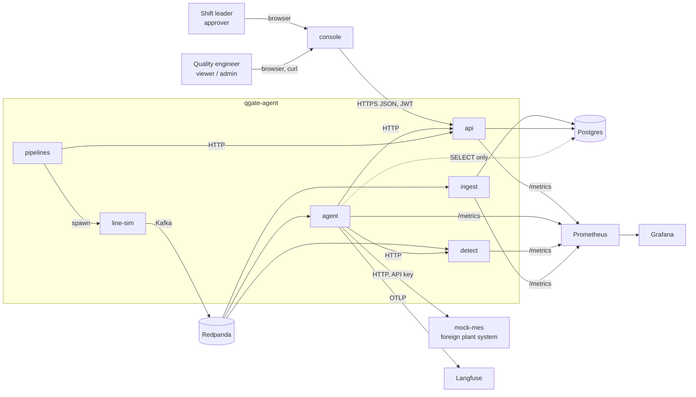
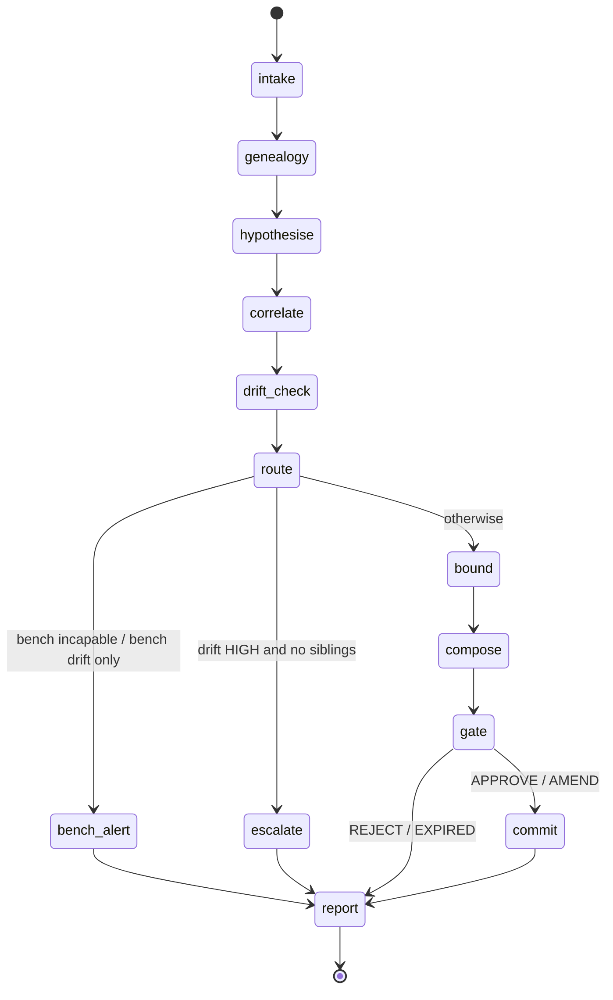
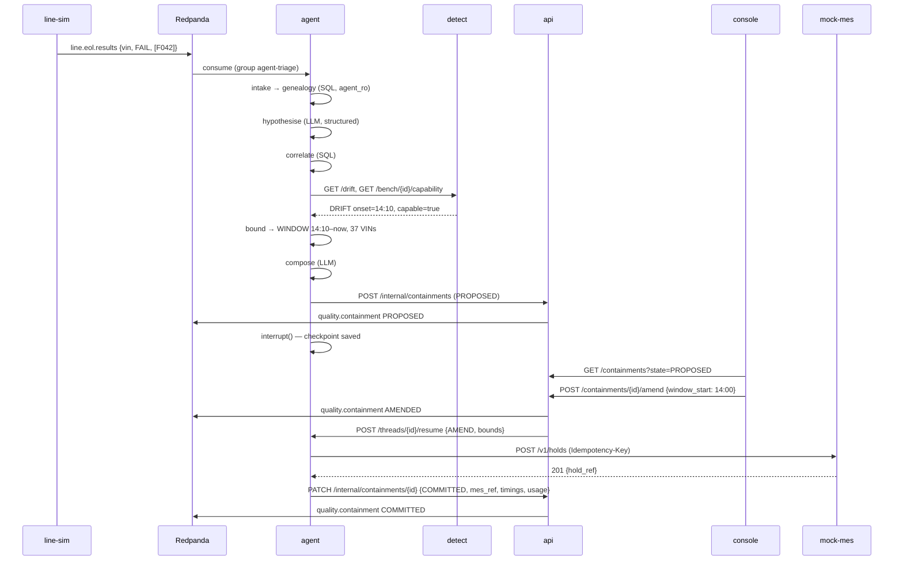

# qgate-agent — Architecture Design

**Status:** accepted · **Date:** 2026-09-21 · **Implements:** the qgate-agent build spec (rev 2)

This document fixes *how the pieces fit*: repository layout, service boundaries, every contract between services, the data model, the agent's state machine, the runtime topology, and the operational plumbing. The build spec says *what* and *why*; this says *where* and *through which interface*. Anything a later implementation plan needs to name — a port, a topic, a table, an endpoint, an environment variable — is named here once.

---

## 1. Decisions already taken

| Decision | Choice | Alternatives rejected | Recorded in |
|---|---|---|---|
| Repository layout | Monorepo | Polyrepo (8 repos, 8 CI configs; reviewer friction) | ADR-005 |
| LLM provider | Provider-agnostic via `langchain.chat_models.init_chat_model`; provider chosen by env; cassettes recorded against one provider | Single vendor; Ollama-only | ADR-006 |
| Triage trigger | Event-driven: `agent` consumes `line.eol.results`; human decisions reach the agent via HTTP resume from `api` | API-triggered only; fully event-driven decisions | ADR-007 |
| Public name | `qgate-agent` | — | — |
| Data source | Synthetic generator primary; Bosch/SECOM behind a local-path adapter, never committed | Kaggle data in repo | ADR-001 |
| Topic keying | Measurements by VIN, alerts by station | Uniform key; no key | ADR-002 |
| Approval gate | Non-bypassable `interrupt()`; no flag, no env var, no test hook that skips it | `AUTO_APPROVE` for tests | ADR-003 |
| Division of labour | SQL correlates and bounds; model orchestrates, ranks hypotheses, explains | LLM does correlation | ADR-004 |

---

## 2. System context



**Trust boundary:** `mock-mes` is *outside* the system. It has its own auth, its own contract, and it fails on purpose. Everything the agent knows about the plant's system of record it learns through that contract.

---

## 3. Approaches considered

### 3.1 Where the agent runs

| Approach | Trade-off | Verdict |
|---|---|---|
| **A. `agent` as its own worker: Kafka consumer + small HTTP surface (chosen)** | Clear blast-radius story; restart-survival is testable in isolation; one more container | Chosen |
| B. Agent embedded in `api` process | Fewer moving parts; but `api` then holds LLM credentials and the DB-write role in the same process as the agent — kills the "agent cannot write" claim | Rejected |
| C. Agent as Prefect flow | Orchestration built in; but a triage is latency-sensitive and interactive, Prefect is batch-shaped | Rejected |

### 3.2 Ownership of containment state

| Approach | Trade-off | Verdict |
|---|---|---|
| **A. `api` owns `containment` + `containment_audit`; agent submits and reports via HTTP (chosen)** | Agent stays read-only on Postgres; one writer per table; two HTTP hops | Chosen |
| B. Agent writes containment tables directly | Fewer hops; agent needs a write role — contradicts ADR-003 defence in depth | Rejected |
| C. Containment state lives only in Kafka (event-sourced) | Elegant; but "list pending approvals" becomes a projection you must build, and the console needs it on day one | Rejected |

### 3.3 Detection service shape

| Approach | Trade-off | Verdict |
|---|---|---|
| **A. One image, two processes: `detect` (HTTP) and `detect-worker` (consumer) (chosen)** | Worker backpressure cannot stall the agent's drift query; same code, same tests | Chosen |
| B. One process with background consumer task | Simpler compose; a slow consumer starves the HTTP loop under burst | Rejected |

---

## 4. Repository layout

```text
qgate-agent/
├── README.md                     # §14 of the spec, written last
├── RUNBOOK.md                    # shift-leader operations
├── LICENSE                       # MIT
├── Makefile                      # up, down, demo, test, eval, token, lint
├── docker-compose.yml            # profiles: core, obs, eval, chaos, airgap
├── .env.example
├── pyproject.toml                # uv workspace root
├── uv.lock
├── .pre-commit-config.yaml       # ruff, mypy, gitleaks, prettier
├── .github/workflows/
│   ├── ci.yml                    # lint → unit → contract → integration → eval-replay → scan → build
│   ├── nightly.yml               # eval-live via pipelines, publish report
│   └── release.yml               # tag → multi-arch build → GHCR
├── packages/
│   ├── qgate-core/               # shared: domain models, settings, avro, otel, logging, auth
│   │   └── src/qgate_core/
│   │       ├── models/           # Pydantic: Vin, Station, Measurement, EolResult, Containment...
│   │       ├── avro.py           # schema loading, registry client, (de)serialisers
│   │       ├── kafka.py          # producer/consumer factories, DLQ helper
│   │       ├── otel.py           # tracer/meter setup, OTLP exporters
│   │       ├── logging.py        # structlog JSON with trace_id
│   │       ├── settings.py       # pydantic-settings base
│   │       └── auth.py           # JWT encode/decode, Role enum
│   └── qgate-generator/          # synthetic line + scenarios + Python replay producer
│       └── src/qgate_generator/
│           ├── line.py           # LineModel: stations, takt, shifts, benches
│           ├── scenarios/        # one module per scenario, each yields ground truth
│           ├── stream.py         # event ordering, timestamps at takt
│           └── cli.py            # `qgate-gen replay --scenario tool_wear --speed 10`
├── services/
│   ├── line-sim/                 # C++20, CMake, librdkafka, avro-cpp, Catch2
│   │   ├── CMakeLists.txt
│   │   ├── src/{main,scheduler,producer,scenario_reader}.cpp
│   │   ├── tests/
│   │   └── Dockerfile            # multi-stage: build → distroless runtime
│   ├── ingest/
│   ├── detect/                   # entrypoints: `detect api`, `detect worker`
│   ├── agent/
│   │   └── src/qgate_agent/
│   │       ├── graph.py          # build_graph(): nodes, edges, checkpointer
│   │       ├── state.py          # TriageState TypedDict
│   │       ├── nodes/            # one module per node
│   │       ├── tools/            # one module per tool
│   │       ├── prompts/          # versioned .md prompts, loaded by id
│   │       ├── llm.py            # init_chat_model + cassette wrapper
│   │       ├── consumer.py       # eol.results consumer → start thread
│   │       └── http.py           # /triage, /threads/{id}, /threads/{id}/resume
│   ├── api/
│   └── mock-mes/
├── console/                      # Vite + React 18 + TS + TanStack Query + react-router
│   ├── src/{pages,components,api,auth}/
│   ├── e2e/                      # Playwright smoke
│   └── Dockerfile                # build → nginx
├── pipelines/                    # Prefect 3
│   ├── flows/{replay_scenario,nightly_eval,publish_report}.py
│   └── prefect.yaml
├── schemas/                      # *.avsc, one per topic, versioned in filename
├── knowledge/
│   └── fault_map.yaml            # fault code → candidate stations + rationale
├── scenarios/                    # *.yaml scenario parameters (generator reads these)
├── db/
│   ├── migrations/               # dbmate: 0001_dims.sql, 0002_facts.sql, 0003_containment.sql, 0004_roles.sql
│   └── queries/                  # named SQL used by tools; tested against fixtures
├── eval/
│   ├── goldens/                  # 50 × *.yaml, frozen at tag goldens-v1
│   ├── cassettes/                # recorded LLM responses per golden
│   ├── baseline.json             # escapes, precision, recall, p95 non-LLM
│   └── harness/                  # runner, scorers, report renderer
├── observability/
│   ├── prometheus.yml
│   └── grafana/dashboards/qgate.json
├── infra/k3s/                    # documented path only: kustomize manifests, not CI-tested
└── docs/
    ├── adr/                      # ADR-001…
    ├── design/                   # this document and later design notes
    └── plans/                    # implementation plans, one per phase
```

**Workspace rules**

- Python 3.12, `uv` workspace; every service and package has its own `pyproject.toml`, depends on `qgate-core` by workspace path.
- One `Dockerfile` per service; all multi-stage; base images pinned by digest; non-root user.
- `make` is the only entry point a human types. Every target maps to one CI job so "works locally" and "works in CI" are the same command.

---

## 5. Runtime topology

### 5.1 Containers and ports

| Service | Image | Port (host) | Profile | Depends on (healthy) |
|---|---|---|---|---|
| `redpanda` | `redpandadata/redpanda` | 9092 kafka, 8081 registry, 9644 admin | core | — |
| `postgres` | `postgres:16` | 5432 | core | — |
| `migrate` | `amacneil/dbmate` (one-shot) | — | core | postgres |
| `line-sim` | `ghcr.io/<owner>/qgate-line-sim` | — | core | redpanda, migrate |
| `ingest` | `…/qgate-ingest` | 8010 (metrics) | core | redpanda, migrate |
| `detect` | `…/qgate-detect` (`detect api`) | 8002 | core | migrate |
| `detect-worker` | same image (`detect worker`) | 8012 (metrics) | core | redpanda, migrate |
| `agent` | `…/qgate-agent` | 8001 | core | redpanda, migrate, detect, api |
| `api` | `…/qgate-api` | 8000 | core | migrate, redpanda |
| `mock-mes` | `…/qgate-mock-mes` | 8003 | core | — |
| `console` | `…/qgate-console` (nginx) | 8080 | core | api |
| `langfuse` + `langfuse-db` | `langfuse/langfuse` | 3001 | obs | — |
| `prometheus` | `prom/prometheus` | 9090 | obs | — |
| `grafana` | `grafana/grafana` | 3000 | obs | prometheus |
| `prefect-server` | `prefecthq/prefect` | 4200 | eval | postgres |
| `prefect-worker` | `…/qgate-pipelines` | — | eval | prefect-server, api |
| `ollama` | `ollama/ollama` | 11434 | airgap | — |
| `toxiproxy` | `ghcr.io/shopify/toxiproxy` | 8474 | chaos | — |

`make up` = `core`; `make up-all` = `core obs eval`; `make chaos` adds `chaos` and routes `agent → mock-mes` through toxiproxy.

### 5.2 Network

Single compose network. Only `api`, `console`, and the observability UIs publish host ports in the default profile; internal services publish only in `dev` profile for debugging. `agent` has no inbound route from the host — only `api` calls it.

### 5.3 Environment (per service, from `.env`)

| Variable | Used by | Purpose |
|---|---|---|
| `KAFKA_BOOTSTRAP` `SCHEMA_REGISTRY_URL` | all Kafka clients | Redpanda |
| `DATABASE_URL_<ROLE>` | one per role: `INGEST_RW`, `API_RW`, `AGENT_RO`, `DETECT_RO`, `CHECKPOINT_RW` | Postgres, least privilege |
| `LLM_PROVIDER` `LLM_MODEL` `LLM_API_KEY` | agent | `init_chat_model(model, model_provider=…)` |
| `LLM_MODE` = `live` \| `replay` \| `record` | agent, eval | Cassette behaviour |
| `CASSETTE_DIR` | agent | `eval/cassettes` |
| `JWT_SECRET` `JWT_ISSUER` | api, console (issuer only) | HS256 dev auth |
| `MES_BASE_URL` `MES_API_KEY` | agent | Foreign system credential |
| `DETECT_BASE_URL` `API_BASE_URL` | agent | Internal HTTP |
| `APPROVAL_TIMEOUT_S` (default 1800) | api | Expiry → escalation |
| `OTEL_EXPORTER_OTLP_ENDPOINT` `LANGFUSE_PUBLIC_KEY` `LANGFUSE_SECRET_KEY` | agent, api | Traces |
| `SCENARIO` `REPLAY_SPEED` `SEED` | line-sim | Which scenario, how fast |

---

## 6. Contracts

### 6.1 Kafka topics and Avro schemas

All records: Avro, Confluent wire format, registered in Redpanda's schema registry under subject `<topic>-value`. Compatibility mode `BACKWARD`. Timestamps are `long` logicalType `timestamp-millis`, UTC, set by the producer from the simulated clock.

**`line.build.events`** — key `vin: string`

```json
{"type":"record","name":"BuildEvent","namespace":"qgate.line","fields":[
 {"name":"vin","type":"string"},
 {"name":"station_id","type":"string"},
 {"name":"sequence_no","type":"long"},
 {"name":"entered_at","type":{"type":"long","logicalType":"timestamp-millis"}},
 {"name":"shift_id","type":"string"},
 {"name":"operator_id","type":"string"},
 {"name":"parts_lots","type":{"type":"array","items":"string"}}
]}
```

**`line.measurements`** — key `vin`

```json
{"type":"record","name":"Measurement","namespace":"qgate.line","fields":[
 {"name":"vin","type":"string"},
 {"name":"station_id","type":"string"},
 {"name":"characteristic_id","type":"string"},
 {"name":"bench_id","type":"string"},
 {"name":"measured_at","type":{"type":"long","logicalType":"timestamp-millis"}},
 {"name":"value","type":"double"},
 {"name":"unit","type":"string"},
 {"name":"nominal","type":"double"},
 {"name":"lower_limit","type":"double"},
 {"name":"upper_limit","type":"double"},
 {"name":"repeat_no","type":"int","default":1}
]}
```

`repeat_no > 1` marks the bench repeat measurements the generator emits on a sample of vehicles; `detect` computes `%GRR` from them.

**`line.eol.results`** — key `vin`

```json
{"type":"record","name":"EolResult","namespace":"qgate.line","fields":[
 {"name":"vin","type":"string"},
 {"name":"tested_at","type":{"type":"long","logicalType":"timestamp-millis"}},
 {"name":"bench_id","type":"string"},
 {"name":"result","type":{"type":"enum","name":"Result","symbols":["PASS","FAIL"]}},
 {"name":"fault_codes","type":{"type":"array","items":"string"}}
]}
```

**`quality.alerts`** — key `station_id`

```json
{"type":"record","name":"QualityAlert","namespace":"qgate.quality","fields":[
 {"name":"alert_id","type":"string"},
 {"name":"station_id","type":"string"},
 {"name":"characteristic_id","type":["null","string"],"default":null},
 {"name":"bench_id","type":["null","string"],"default":null},
 {"name":"kind","type":{"type":"enum","name":"AlertKind","symbols":["DRIFT","STEP","RULE_VIOLATION","BENCH_INCAPABLE"]}},
 {"name":"severity","type":{"type":"enum","name":"Severity","symbols":["LOW","MEDIUM","HIGH"]}},
 {"name":"detected_at","type":{"type":"long","logicalType":"timestamp-millis"}},
 {"name":"estimated_onset","type":["null",{"type":"long","logicalType":"timestamp-millis"}],"default":null},
 {"name":"method","type":"string"},
 {"name":"evidence","type":{"type":"map","values":"double"}}
]}
```

**`quality.containment`** — key `containment_id`

```json
{"type":"record","name":"ContainmentEvent","namespace":"qgate.quality","fields":[
 {"name":"containment_id","type":"string"},
 {"name":"thread_id","type":"string"},
 {"name":"state","type":{"type":"enum","name":"State","symbols":["PROPOSED","APPROVED","AMENDED","REJECTED","EXPIRED","COMMITTED","ESCALATED"]}},
 {"name":"occurred_at","type":{"type":"long","logicalType":"timestamp-millis"}},
 {"name":"actor","type":"string"},
 {"name":"station_id","type":["null","string"],"default":null},
 {"name":"window_start","type":["null",{"type":"long","logicalType":"timestamp-millis"}],"default":null},
 {"name":"window_end","type":["null",{"type":"long","logicalType":"timestamp-millis"}],"default":null},
 {"name":"lot_ids","type":{"type":"array","items":"string"},"default":[]},
 {"name":"vin_count","type":"int"},
 {"name":"mes_ref","type":["null","string"],"default":null}
]}
```

**`line.dlq`** — key: original key; value JSON `{topic, partition, offset, error, raw_b64, failed_at}`.

**Consumer groups:** `ingest` (all three `line.*`), `detect-worker` (`line.measurements`), `agent-triage` (`line.eol.results`). Partitions: 6 per `line.*` topic, 3 for `quality.*`. Auto-commit off; commit after successful write.

### 6.2 `api` — public HTTP (FastAPI, OpenAPI at `/openapi.json`)

Auth: `Authorization: Bearer <JWT>`; claims `sub`, `role ∈ {viewer, approver, admin}`, `exp`. Dev tokens minted by `make token ROLE=approver SUB=alice`.

| Method & path | Role | Body / response | Notes |
|---|---|---|---|
| `POST /triage` | approver | `{vin, fault_codes[]}` → `202 {thread_id}` | Manual trigger; proxies to `agent POST /triage` |
| `GET /containments?state=PROPOSED` | viewer | `[ContainmentSummary]` | Console queue |
| `GET /containments/{id}` | viewer | `ContainmentDetail` incl. evidence, draft order, VIN list, confidence | Console case view |
| `POST /containments/{id}/approve` | approver | `{reason?}` → `200 ContainmentDetail` | Sets APPROVED, calls agent resume |
| `POST /containments/{id}/amend` | approver | `{window_start?, window_end?, lot_ids?, station_id?, reason}` → `200` | Sets AMENDED with diff, calls agent resume with amended bounds |
| `POST /containments/{id}/reject` | approver | `{reason}` → `200` | Sets REJECTED, calls agent resume; graph ends |
| `POST /internal/containments` | service (agent) | `ContainmentProposal` → `201 {containment_id}` | From `submit_for_approval`; writes PROPOSED + audit row |
| `PATCH /internal/containments/{id}` | service (agent) | `{state: COMMITTED, mes_ref}` or `{state: ESCALATED, reason}` | Agent reports outcome |
| `GET /audit?from&to&family` | viewer | `[AuditRow]` | Console chart, eval harness |
| `GET /metrics` | none | Prometheus text | Scraped |
| `GET /health` `GET /ready` | none | `200` / `503` | Compose + k8s probes |

`/internal/*` requires a service JWT (`role: service`) and is not exposed by the console's nginx.

### 6.3 `agent` — internal HTTP

| Method & path | Body → response | Notes |
|---|---|---|
| `POST /triage` | `{vin, fault_codes[], eol_ts?}` → `202 {thread_id}` | Starts `graph.ainvoke` in background task, `thread_id = uuid7` |
| `GET /threads/{thread_id}` | → `{status: RUNNING\|WAITING_GATE\|DONE\|FAILED, next_node, state_summary}` | Reads checkpointer |
| `POST /threads/{thread_id}/resume` | `{decision: APPROVE\|AMEND\|REJECT, amended?: Bounds, actor, reason}` → `202` | `graph.ainvoke(Command(resume=decision), config)` |
| `GET /health` `GET /ready` `GET /metrics` | | |

### 6.4 `detect` — internal HTTP

| Method & path | Response | Notes |
|---|---|---|
| `GET /drift?station_id&characteristic_id&from&to` | `{verdict: NONE\|DRIFT\|STEP, onset: ts\|null, severity, method: "pelt"\|"cusum"\|"ewma", confidence: 0-1, evidence: {…}}` | Change-point on `fact_measurement` deviation series via `DETECT_RO` |
| `GET /bench/{bench_id}/capability?from&to` | `{grr_pct, repeatability, bias, capable: bool, n_repeats, threshold_pct: 30}` | AIAG MSA-style: `%GRR = 6σ_gauge / tolerance × 100`; `capable = grr_pct < 30` (documented, tunable) |
| `GET /stations/{station_id}/alerts?from&to` | `[QualityAlert]` | Materialised from worker |

### 6.5 `mock-mes` — foreign system HTTP

Auth `X-API-Key`. Its OpenAPI is authored *first* in `services/mock-mes/openapi.yaml` and the server is generated/validated against it — the point is that the agent integrates against a contract it does not own.

| Method & path | Body → response | Notes |
|---|---|---|
| `POST /v1/holds` | header `Idempotency-Key`; `{external_ref, station_id?, window_start?, window_end?, lot_ids[], vins[], reason}` → `201 {hold_ref}` or `200` on replay of same key | Duplicate key with different body → `409` |
| `GET /v1/holds/{hold_ref}` | → `Hold` | |
| `POST /_chaos` | `{mode: "latency"\|"error"\|"drop_ack", seconds, status?: 503}` | Test-only; disabled unless `MES_CHAOS=1` |
| `GET /_stats` | `{holds, duplicate_replays, duplicate_conflicts}` | Chaos assertions |

### 6.6 Console → api

The console calls only §6.2 endpoints, via `VITE_API_BASE_URL`, JWT pasted into a settings drawer and kept in `sessionStorage`. No other backend.

---

## 7. Data model

### 7.1 Tables (Postgres 16, schema `qgate`)

```sql
-- dims
dim_station        (station_id PK, name, sequence_pos int, takt_s int, operations text[])
dim_characteristic (characteristic_id PK, station_id FK, name, unit, nominal, lower_limit, upper_limit)
dim_shift          (shift_id PK, label, starts_at time, ends_at time, crew)
dim_bench          (bench_id PK, station_id FK, repeatability_sigma, bias, calibrated_at)

-- facts
fact_build_event   (vin, station_id FK, sequence_no bigint, entered_at timestamptz, shift_id FK,
                    operator_id, parts_lots text[], PK (vin, station_id))
  idx: (station_id, entered_at), GIN (parts_lots)
fact_measurement   (id bigserial PK, vin, station_id, characteristic_id FK, bench_id FK,
                    measured_at timestamptz, value, deviation GENERATED ALWAYS AS (value - nominal) STORED,
                    out_of_tolerance bool GENERATED, repeat_no int)
  idx: (vin), (station_id, characteristic_id, measured_at), (bench_id, measured_at) WHERE repeat_no > 1
  partitioned BY RANGE (measured_at), monthly            -- shows intent; one partition in the demo
fact_eol_result    (vin, tested_at, bench_id, result, PK (vin, tested_at))
fact_eol_fault     (vin, tested_at, fault_code, PK (vin, tested_at, fault_code))
  idx: (fault_code, tested_at)

-- decisions
containment        (containment_id uuid PK, thread_id uuid, state, kind ENUM('WINDOW','LOT','SINGLE','NONE'),
                    station_id, window_start, window_end, lot_ids text[], vin_count int,
                    confidence numeric(3,2), reason text, draft_order text,
                    proposed_at, decided_at, decided_by, mes_ref, idempotency_key uuid UNIQUE)
containment_vin    (containment_id FK, vin, PK (containment_id, vin))
containment_audit  (audit_id bigserial PK, containment_id FK, thread_id, golden_id text NULL,
                    proposed jsonb, decided jsonb, diff jsonb,           -- proposal, human decision, computed delta
                    decision, actor, latency_total_ms, latency_llm_ms, latency_non_llm_ms,
                    prompt_tokens, completion_tokens, cost_usd numeric(8,5), created_at)

-- LangGraph-owned (created by langgraph-checkpoint-postgres .setup())
checkpoints, checkpoint_blobs, checkpoint_writes, checkpoint_migrations
```

### 7.2 Roles

| Role | GRANTs | Used by |
|---|---|---|
| `ingest_rw` | INSERT/UPDATE on `fact_*`, SELECT on `dim_*` | ingest |
| `api_rw` | ALL on `containment*`, SELECT on everything else | api |
| `agent_ro` | SELECT on `dim_*`, `fact_*`, `containment*` | agent tools |
| `detect_ro` | SELECT on `dim_*`, `fact_measurement` | detect |
| `checkpoint_rw` | ALL on `checkpoint*` only | agent (checkpointer connection, separate from tools connection) |
| `migrate` | owner | dbmate |

Two connections in `agent`: `AGENT_RO` for tools, `CHECKPOINT_RW` for state. The tools code path literally cannot reach a writable connection.

### 7.3 Named queries (`db/queries/*.sql`, loaded by `aiosql`)

| Name | Backs tool | Budget |
|---|---|---|
| `genealogy_by_vin` | `get_vehicle_genealogy` | < 50 ms p95 at 5 M measurements |
| `station_spec` | `get_station_spec` | < 5 ms |
| `correlated_failures` | `find_correlated_failures` — same fault code, station in path, `tested_at` within window; grouped by `shift_id`, unnest `parts_lots` | < 100 ms |
| `vins_in_window` | `estimate_containment_window` (kind WINDOW) — `fact_build_event WHERE station_id = $1 AND entered_at BETWEEN $2 AND $3` | < 50 ms |
| `vins_by_lot` | `estimate_containment_window` (kind LOT) — `parts_lots @> ARRAY[$1]` via GIN | < 50 ms |

---

## 8. Agent design

### 8.1 State

```python
class Bounds(TypedDict):
    kind: Literal["WINDOW", "LOT", "SINGLE", "NONE"]
    station_id: str | None
    window_start: datetime | None
    window_end: datetime | None
    lot_ids: list[str]
    vins: list[str]
    confidence: float

class TriageState(TypedDict):
    # intake
    thread_id: str
    vin: str
    fault_codes: list[str]
    eol_ts: datetime                    # clock start for latency
    golden_id: str | None               # set by eval harness only
    # evidence
    genealogy: Genealogy | None
    candidate_stations: list[Hypothesis]   # ranked by hypothesise
    siblings: CorrelationResult | None
    drift: DriftVerdict | None
    bench: BenchCapability | None
    # decision
    bounds: Bounds | None
    draft_order: str | None
    containment_id: str | None
    outcome: Literal["PROPOSED", "ESCALATED", "NO_CONTAINMENT"] | None
    human: HumanDecision | None         # filled by resume
    mes_ref: str | None
    # accounting
    timings: dict[str, float]           # node → ms
    llm_usage: list[UsageRecord]
    errors: list[str]
```

### 8.2 Graph



| Node | Reads | Writes | Tools / calls | LLM? |
|---|---|---|---|---|
| `intake` | vin, fault_codes | normalised fault_codes; errors | — | no |
| `genealogy` | vin | genealogy | `get_vehicle_genealogy` | no |
| `hypothesise` | fault_codes, genealogy | candidate_stations | `get_station_spec` ×k; `fault_map.yaml` | **yes** — ranks and justifies candidates from the map; structured output `list[Hypothesis]`; cannot add a station not in the map (validated) |
| `correlate` | top candidates, fault_codes, eol_ts | siblings | `find_correlated_failures` | no |
| `drift_check` | top candidate, characteristic(s), eol_ts | drift, bench | `check_station_drift` → `detect /drift` and `/bench/{id}/capability` | no |
| `route` | siblings, drift, bench | — | — | no — pure predicate |
| `bound` | siblings, drift | bounds | `estimate_containment_window` | no — arithmetic; kind chosen by rule: lot-concentrated siblings → LOT, drift onset → WINDOW, else SINGLE |
| `compose` | everything | draft_order | `draft_containment_order` | **yes** — writes the order; must cite bounds verbatim (validated by regex against `bounds`) |
| `gate` | draft_order, bounds | containment_id, human | `submit_for_approval` → `api POST /internal/containments`; then `interrupt()` | no |
| `commit` | human, bounds | mes_ref | `mock-mes POST /v1/holds` with `Idempotency-Key = containment_id`; `api PATCH /internal/containments/{id}` | no |
| `bench_alert` / `escalate` | evidence | outcome | `api POST /internal/containments` with kind NONE + reason | `escalate` uses LLM for the one-paragraph explanation; `bench_alert` is templated |
| `report` | timings, llm_usage | — | writes audit via `api PATCH` (`latency_*`, tokens, cost) | no |

**LLM is called in exactly two-and-a-half places.** Every LLM output is a Pydantic model with a validator that rejects anything not grounded in state (unknown station, bounds that differ from `bounds`). A validation failure retries once with the error appended, then falls to `escalate`.

### 8.3 Gate mechanics

- `gate` calls `interrupt(payload)`; LangGraph persists the checkpoint via `PostgresSaver` on `CHECKPOINT_RW` and returns control.
- `api` marks the row `PROPOSED`, starts an expiry timer (`APPROVAL_TIMEOUT_S`, persisted as `expires_at`; a periodic task sweeps, not an in-memory timer).
- Human decision → `api` updates row, emits `quality.containment`, calls `agent POST /threads/{id}/resume`.
- On resume, `gate` receives `HumanDecision`; `AMEND` overwrites `bounds` with the human's before `commit`; the diff is computed by `api` and stored in `containment_audit.diff`.
- Expiry → `api` sets `EXPIRED`, emits `ESCALATED` event, calls resume with `REJECT` (reason `expired`). Nothing auto-approves.
- On `agent` restart: `GET /threads/{id}` reads the checkpoint; the thread is `WAITING_GATE`; resume works unchanged. **This is the chaos test.**

### 8.4 LLM access layer (`llm.py`)

```
init_chat_model(settings.LLM_MODEL, model_provider=settings.LLM_PROVIDER, temperature=0)
  └─ wrapped by CassetteRunnable(mode=LLM_MODE, dir=CASSETTE_DIR, key=hash(prompt_id, prompt_version, inputs))
       live    → call provider, record nothing
       record  → call provider, write cassette
       replay  → read cassette; missing cassette = test failure, never a live call
```

Prompt files carry front-matter `id`, `version`; the version is part of the cassette key, so changing a prompt invalidates its cassettes deliberately. Usage and cost come from `response_metadata`, priced by a small table in `qgate_core/pricing.py` (labelled as assumptions).

---

## 9. Key sequences

### 9.1 Happy path — station drift



### 9.2 Bench fault — abstain

`drift_check` returns `bench.capable = false` (or bench drift without station drift) → `route` → `bench_alert` → `api POST /internal/containments` with `kind = NONE`, `reason = "Bench EOL-B2 %GRR 41 > 30; measurements not trustworthy; hold nothing, recalibrate bench"` → console shows it in a separate "Alerts" tab; audit row has `decision = NO_CONTAINMENT`. Eval scores this as correct when the golden expects `NONE`.

### 9.3 Restart mid-gate

1. Golden runs to `gate`; `WAITING_GATE`.
2. `docker compose kill agent && docker compose up -d agent`.
3. `GET /threads/{id}` → `WAITING_GATE`; `POST …/resume {APPROVE}` → `COMMITTED`.
4. Assertion: exactly one `containment` row, one MES hold, `mes_ref` set.

### 9.4 MES down mid-commit

1. Toxiproxy cuts `agent → mock-mes` for 20 s during `commit`.
2. `tenacity` retries (5 attempts, exponential jitter, cap 8 s) fail; circuit opens; `commit` writes state `COMMIT_PENDING` via `api PATCH`; graph *does not* end.
3. `api` sweeper re-triggers `resume` every 60 s while `COMMIT_PENDING`; breaker half-open → success → `COMMITTED`.
4. Assertion: `mock-mes /_stats.duplicate_replays ≥ 1`, `holds == 1`.

---

## 10. Detection design (`detect`)

**Worker:** consumes `line.measurements`, maintains per `(station, characteristic)` rolling windows (Redis-free: in-process ring buffers, rebuilt from Postgres on start), applies Western Electric rules 1–4 and EWMA (λ = 0.2), emits `quality.alerts` on rule violation with `kind` RULE_VIOLATION; on EWMA breach runs PELT on the last 500 deviations and emits DRIFT/STEP with `estimated_onset`.

**API `/drift`:** on demand, reads the deviation series for the window from Postgres, runs PELT (`ruptures`, `rbf` cost, penalty from BIC) with CUSUM as cross-check; returns the earliest change-point agreed by both within ±20 takts, else the PELT one with lower confidence. Deterministic given data.

**API `/bench/{id}/capability`:** takes repeat measurements (`repeat_no > 1`) on the bench in the window; `σ_gauge` from within-VIN variance; `%GRR = 6σ_gauge / (upper − lower) × 100`; bias = mean(repeat − first); `capable = %GRR < 30`. Threshold and formula cited in `docs/metrology.md` with the assumption label.

`coldstart-spc` (P2) is the library these two live behind; in P1 they are implemented inline in `detect` and later extracted.

---

## 11. Observability

| Signal | Producer | Sink | Names |
|---|---|---|---|
| Traces | agent (per node + per tool span), api, detect | Langfuse via OTLP (`/api/public/otel`) | span attrs: `thread_id`, `golden_id`, `node`, `prompt_id`, `prompt_version` |
| Metrics | every Python service via `prometheus_client`; line-sim via `prometheus-cpp` pushless `/metrics` | Prometheus | below |
| Logs | all | stdout JSON, `trace_id` field | Docker logs; Loki not in scope |

**Metric names (stable; the dashboard depends on them)**

```
triage_duration_seconds{phase="total|llm|non_llm"}      histogram  buckets 0.1..60
triage_outcomes_total{outcome="PROPOSED|ESCALATED|NO_CONTAINMENT|FAILED"}
gate_pending                                           gauge
gate_decision_seconds                                  histogram   proposal → human decision
gate_decisions_total{decision="APPROVE|AMEND|REJECT|EXPIRED"}
llm_tokens_total{kind="prompt|completion",prompt_id}
llm_cost_usd_total
mes_requests_total{status}  mes_breaker_state{state="closed|open|half_open"}
kafka_consumer_lag{group,topic}                        from Redpanda admin, scraped
ingest_records_total{topic,result="ok|dlq"}
line_sim_events_total{topic}
genealogy_query_seconds                                histogram
```

**Grafana dashboard panels:** throughput & lag; triage latency p50/p95/p99 by phase; gate queue depth and decision time; outcomes by kind; cost per triage; MES breaker state; error rate. SLO panels compute burn against §12 of the spec.

---

## 12. Security architecture

- **AuthN/Z:** `api` HS256 JWT (dev), roles `viewer/approver/admin/service`; `service` tokens for `agent → api /internal/*`. `mock-mes` uses a separate static API key. Console holds the user JWT only in `sessionStorage`.
- **Least privilege:** DB roles §7.2; `agent` has two connections by design.
- **Supply chain:** `uv.lock` committed; `pip-audit` and `trivy image` in CI, fail on CRITICAL; base images by digest; Dependabot weekly.
- **Secrets:** `.env.example` only; `gitleaks` pre-commit and CI; GitHub Actions secrets for nightly `live` eval.
- **Runtime:** non-root, `read_only: true` rootfs with `tmpfs /tmp` where the framework allows; no host ports on internal services by default.
- **Explicitly not done:** TLS, OIDC, network policies, audit log immutability. Listed in README.

---

## 13. CI/CD

`ci.yml` on push/PR — jobs run in parallel where independent, each ≈ `make <target>`:

| Job | Runs | Gate |
|---|---|---|
| `lint` | `ruff check`, `ruff format --check`, `mypy --strict`, `prettier --check`, `clang-format --dry-run` | fail |
| `unit` | `pytest -m unit` (+ hypothesis), `ctest` in the C++ build container | fail; coverage ≥ 85 % on agent/detect/ingest |
| `contract` | `schemathesis run` against `api` and `mock-mes` OpenAPI; Avro compatibility check via registry API | fail |
| `integration` | `pytest -m integration` with testcontainers (Postgres, Redpanda) | fail |
| `eval-replay` | `eval/harness run --mode replay`; compare to `eval/baseline.json` | fail if escapes ↑ or non-LLM p95 ↑ > 20 % |
| `scan` | `pip-audit`, `trivy fs`, `gitleaks` | fail on CRITICAL |
| `build` | `docker buildx bake` all images, `linux/amd64,arm64`, no push | fail |

`release.yml` on tag `v*`: build + push to GHCR, attach SBOM (`syft`), create release with `eval/report.md`.
`nightly.yml` at 02:00 UTC: `make up-all` on the runner, `prefect deployment run nightly-eval`, commit `eval/report.md` and dashboard PNG to `gh-pages`.

---

## 14. Pipelines (Prefect 3)

| Flow | Tasks | Schedule | Artifacts |
|---|---|---|---|
| `replay_scenario(scenario, speed, seed)` | reset topics → run `line-sim` container → wait for `ingest` lag 0 → assert row counts | manual | Markdown table of counts |
| `nightly_eval()` | for each golden: `replay_scenario` → `api POST /triage` → poll → auto-decide from golden's expected human action → collect audit rows → score | 02:00 UTC | `report.md`, `metrics.json`, link to Langfuse session |
| `publish_report(metrics)` | render README metrics block, PNG from Grafana render API, push to `gh-pages` | after `nightly_eval` | site |

Retries: 3 with backoff on container start and API polls. Flows are also the documented "how to run a scenario" for a human.

---

## 15. Console (React)

Four routes, one layout, no design system beyond a small token file:

| Route | Shows | Calls |
|---|---|---|
| `/queue` | PROPOSED and ESCALATED containments, age, confidence, kind | `GET /containments?state=` (poll 5 s) |
| `/case/:id` | Evidence tabs: genealogy path, siblings table by shift/lot, drift chart (onset marked), bench capability; draft order; VIN list | `GET /containments/{id}` |
| `/case/:id/decide` | Approve / Reject / Amend form (window pickers, lot multiselect, reason required) with live VIN-count preview | `POST …/approve\|amend\|reject` |
| `/audit` | Agreement rate, widened vs narrowed, latency p50/p95, cost per triage, by family | `GET /audit` |

Playwright smoke: seed one golden, open `/queue`, open case, amend window by −10 min, submit, assert `COMMITTED` appears.

---

## 16. Deployment story

- **Laptop / on-prem edge:** `docker compose --profile core --profile obs up`. This is the primary and only CI-verified target.
- **Air-gapped:** `--profile airgap` adds Ollama; `LLM_PROVIDER=ollama`, `LLM_MODEL=qwen2.5:14b`; cassettes not shared with cloud provider; documented as "works, weaker".
- **k3s path (documented, not CI-tested):** `infra/k3s/` kustomize with the same images, `Deployment` per service, `StatefulSet` for Postgres and Redpanda, probes mapped from `/health` `/ready`, secrets from `SealedSecret` placeholders. README says exactly this: *"exercised once on a single-node k3s VM; not part of CI."*

---

## 17. ADR index (to be written in Phase 0)

| ADR | Title |
|---|---|
| 001 | Synthetic data is the primary source; competition datasets never committed |
| 002 | Topic keys: VIN for line events, station for alerts |
| 003 | The approval gate is non-bypassable; no configuration can skip it |
| 004 | SQL correlates and bounds; the model orchestrates and explains |
| 005 | Monorepo with uv workspace |
| 006 | Provider-agnostic LLM with cassette record/replay |
| 007 | Event-driven trigger, HTTP resume |
| 008 | `api` owns containment state; agent is read-only on Postgres |
| 009 | Two `detect` processes from one image |
| 010 | dbmate SQL migrations over an ORM |

---

## 18. Risks specific to this architecture

| Risk | Mitigation |
|---|---|
| `interrupt()` semantics change across LangGraph minor versions | Pin `langgraph` and `langgraph-checkpoint-postgres`; the restart chaos test catches regressions |
| Avro + C++ toolchain cost in `line-sim` | Use `avro-cpp` from vcpkg in the build stage; if it burns > 4 h, emit JSON from C++ and let `ingest` accept both encodings behind a header — recorded as a deviation |
| Two HTTP hops for gate decisions add latency to the *human* path, not the proposal path | Acceptable; measured separately as `gate_decision_seconds` |
| Langfuse OTLP ingestion differs by version | Pin Langfuse image; fall back to the Langfuse Python SDK callback if OTLP fails |
| Windows host: file-watch and line endings | `.gitattributes` `* text=auto eol=lf`; all builds inside Docker |

---

## 19. Self-review

- **Spec coverage:** every service in spec §4 has a container (§5.1), a contract (§6), and an owner of its data (§7.2). Every tool in spec §8 maps to a named query (§7.3) or an HTTP endpoint (§6.4/6.5). Every metric in spec §10 has a Prometheus name (§11) or an audit column (§7.1). Every scenario in spec §9 is reachable through `replay_scenario` (§14).
- **Contradictions checked:** spec says `api` produces `quality.containment` — §6.1/§9.1 keep that. Spec says agent "never touches the database directly" — refined to *never writes*; tools read via `agent_ro` (spec §8 already said "Backed by Postgres").
- **Open items deferred to the implementation plan:** exact `fault_map.yaml` contents; PELT penalty value; console visual tokens; k3s manifests.
